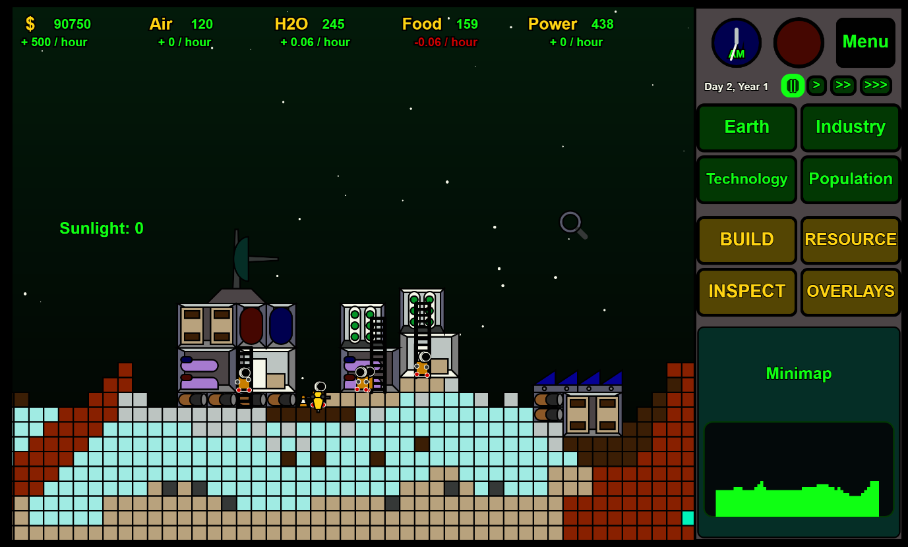
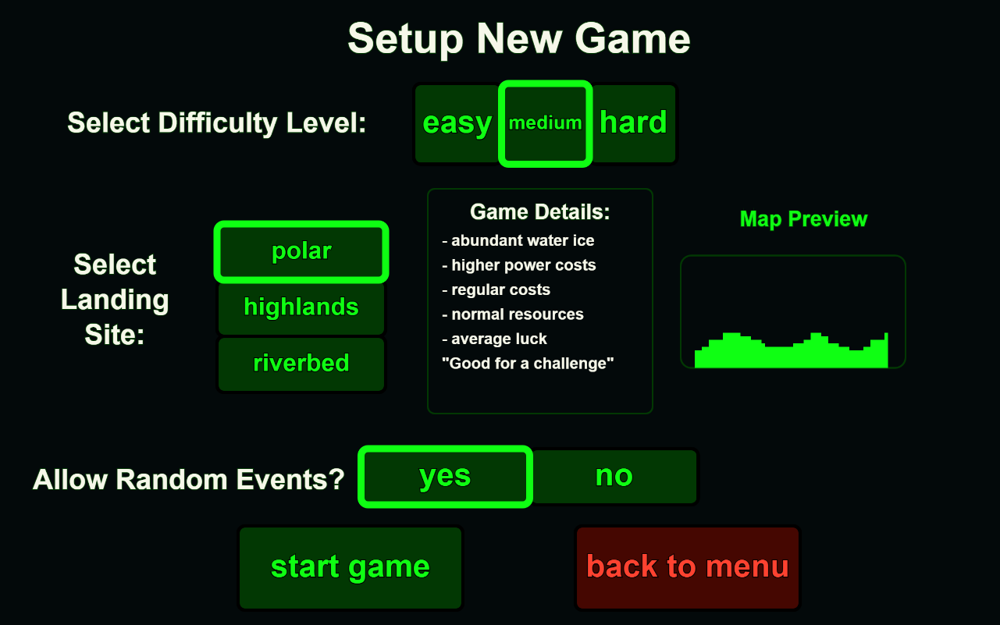
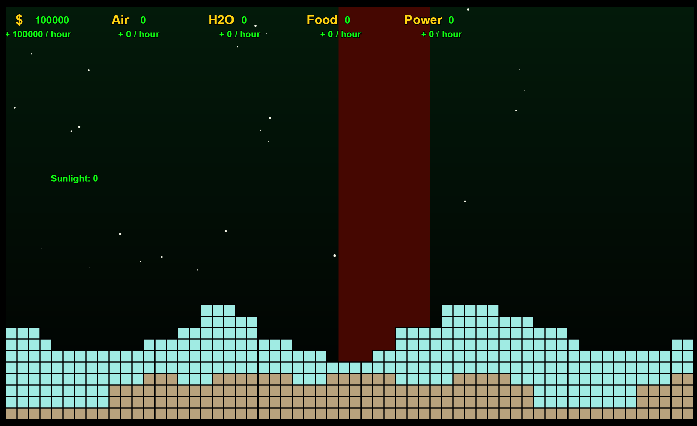
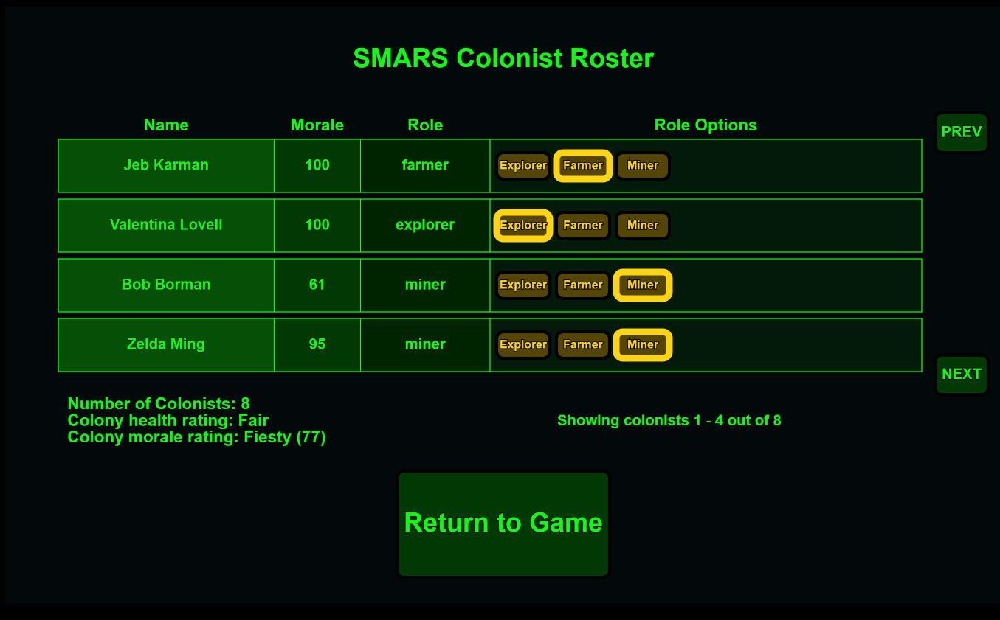
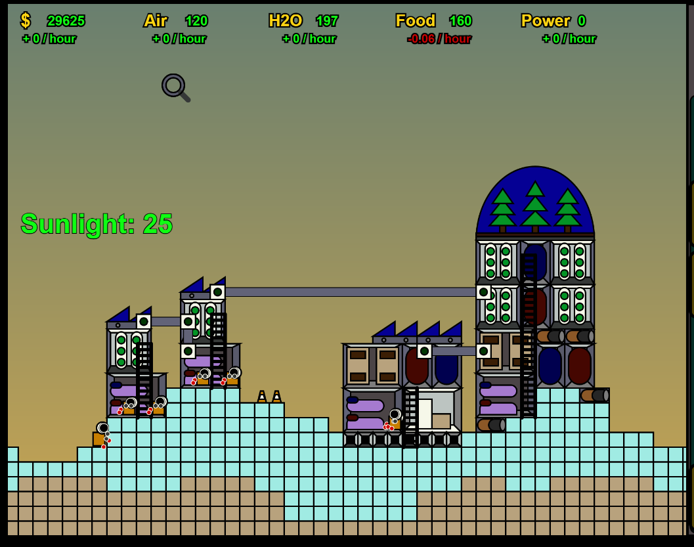

# SMARS

## The Game of Martian Colonization

Play the game now at https://freesmars.com

## Current Features:

### 1. Login Page / User Account Creation

### 2. Customizable Game Start

### 3. Choose Your Landing Site to Start Your Base!

### 4. Manage Your Economy and Workforce

### 5. Build A Base and Tame the Red Planet!

## How to play:

You start off with a small base, comprised of several modules that were packed into your colony's landing craft.

Spend money to build additional structures, and assign your population to work in various jobs (right now that's either mining for water or farming in a hydroponics module).

The colony's population grows gradually over time, as more and more new terraformers are sent from Earth, drawn by stories of your managerial prowess.

Keep your population well fed, watered and rested to increase their morale, and to attract more newcomers.

## To start the project up in local development mode:

Frontend:

    cd frontend/

    npm run start

Backend:

    cd backend/

    npm run dev

Database:

    * Ensure mongo service is running

Once the stack has started, you should be able to play the game by going to http://localhost:1234 in your internet browser

## Building the game's Docker images from the local VM environment:

- Clone git repo into local VM directory
- Set environment variables in local .env file:

  SMARS_ENVIRONMENT=<environment (e.g. 'dev' 'staging' or 'prod' )>
  DOMAIN_NAME=<domain name (e.g. test.freesmars.com)>
  DOCKER_REPO=<repo name (e.g. danatack/smars )>

- Run the build script:
  `bash startBuild.sh`

- Deploy cloud machine for the environment matching the build (dev, staging or production)
- SSH into cloud machine via PuTTY
- cd into smars directory
- Run Docker compose to pull and deploy the latest image: `docker compose up`

## Cloud Environment setup:

- Pull git repo
- cd into terraform directory
- Create .env file with the following variables:

  export TF_VAR_SMARS_ENVIRONMENT=<environment>
  export TF_VAR_DOMAIN_NAME=<domain name>
  export TF_VAR_ZONE_ID=<hosted zone ID>
  export TF_VAR_SSH_ALLOW_ORIGIN=<ip address for ssh access origin (e.g. your PC's IP Address)>

- Run `bash startPlan` and verify the resulting Terraform plan
- Run `bash startDeploy` and enter 'yes' to confirm Terraform apply

## Credits and Acknowledgements

First and foremost, a huge thank you to Lauren Lee McCarthy and Qianqian Ye, the Processing foundation, and all of the many others who contributed to P5.js, which provides the game's graphic engine. To learn more about this incredible resource, please pay a visit to https://p5js.org/ and tell 'em who sent you!

Special thanks also to WindyVis MIDI classics ( https://windy-vis.com/art/classic-midi/index2.html ) and Gustav Holst, for an awesome MIDI version of Holst's classic "Mars" from The Planets Symphony.

Many of the game's sounds were provided by the good folks at FreeSound.org. SMARS would like to thank the following contributors to that wonderful open-source library:

- Fission9 (wind and ambient sound effects)
- Aegersum (rocket engine effects)
- RyanKingArt (airlock sound effects)
- NewAngelGamer22GamesDeveloper (various bleeps and bloops)
- Bumpelsnake (more bleeps and bloops)
- AlienXXX (for one very long bleep)
- Qubodup (synth bleeps)
- DeadRobotMusic (more bloops)
- TimKahn (yet more bloops)
- Isaac200000 (error bloops)
- Tomi_Slav (rock and stone sound effects)
- IronCross32 (various UX sound effects - tings and pings)
- Wagna (time warp sound effects)
- InspectorJ (construction/jackhammer effects)
- SoundslikeWillem (more airlock/air pressure sounds)
- Adharca (more construction/metallic sound effects)
- ZePurple (shoveling and digging sound effects)
- Cpark12 (bulldozer/excavator sound effects)
- AndersMMG (more shoveling/digging sound effects)
- GameDevC_G (power/electric sound effects)
- Emile99 (more rock and stone sound effects)

Also, a big thank you to the following free sound editing sites, who enabled the in-house production of the game's other sound effects (notably, the voices of the individual Smartian colonists):

- https://www.online-convert.com/
- https://audiotrimmer.com/#
- https://audioalter.com/
- https://online-voice-recorder.com/

Lastly, a big thank-you to Will Wright and Yoot Saito - the creators of SimTower - as well as Squad, the makers of Kerbal Space Program. Although more than two decades apart, both of these games provided a huge inspiration for SMARS (as well as countless hours of fun and frustration!)
