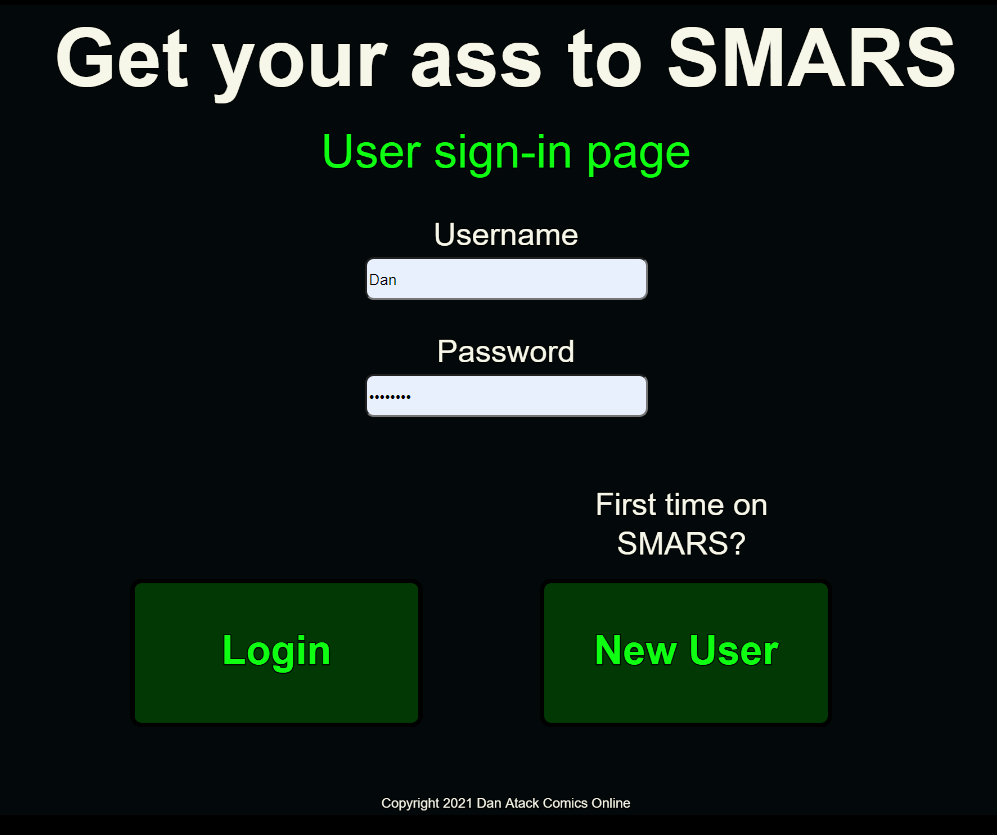

# SMARS

The Game of Martian Colonization

( Coming Soon to an Internet Near You! )

## Current Features (in Development only):

### 1. Login Page / User Account Creation

### 2. Customizable Game Start

### 3. Choose Your Landing Site to Start Your Base!

### 4. Manage Your Economy and Workforce

### 5. Build A Base and Tame the Red Planet!

## To start the project up:

Frontend:

    cd frontend/

    npm run start

Backend:

    cd backend/

    npm run dev

Database:

    * Ensure mongo service is running
